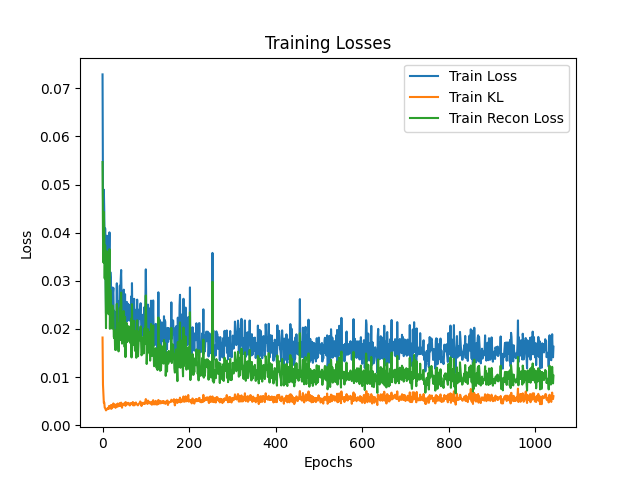
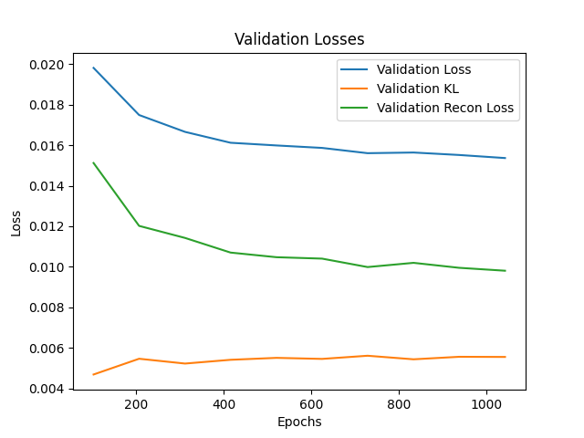
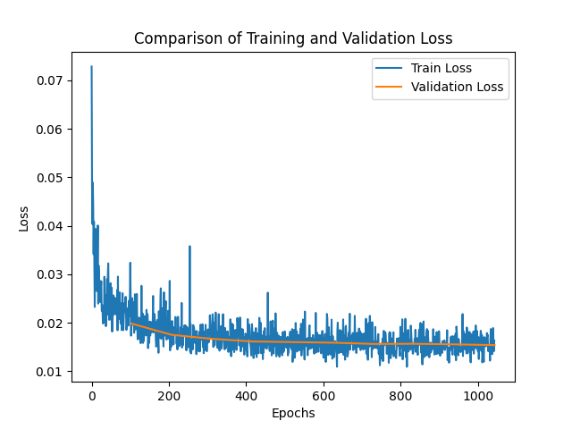
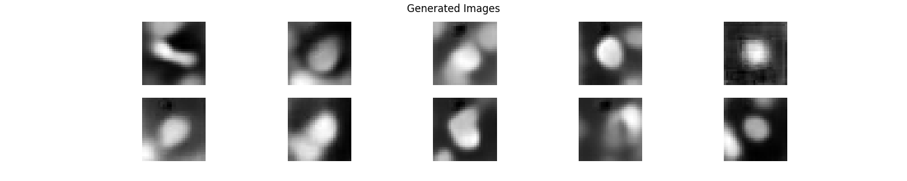
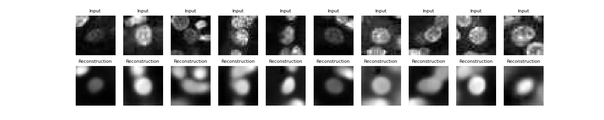

# Version 1

## Experiment Details

The experiment was conducted using the tissuemnist dataset with the following [parameters](hparams.yaml):

```yaml
batch_size: 32
checkpoint_dir: results/checkpoints/resnet_vae
config: null
data_dir: .
dataset: tissuemnist
enc_out_dim: 512
first_conv: false
input_height: 28
kl_coeff: 0.1
latent_dim: 256
log_dir: results/logs
lr: 0.0001
max_epochs: 10
maxpool1: false
num_workers: 8
model: resnet_vae
```

## Performance Metrics

Throughout the experiment, the training and validation losses were carefully monitored. Below are the plots generated from these metrics, which can be found in the logs directory as specified in the configuration file.

### Training Loss

  
The training loss decreased steadily, indicating that the model was learning effectively over the epochs.

### Validation Loss

  
The validation loss mirrored the training loss, suggesting that the model was generalizing well to unseen data.

### Train vs. Val Loss

  
The train vs. val loss plot shows how the model's loss evolved during training.

### Visual Outputs

The model's ability to generate and reconstruct images was also evaluated. The visual assessment of the model's performance is demonstrated through:

Generated Images: Sample images generated by the model are displayed below.


Reconstructions: Below are comparisons between original images and their reconstructions.

