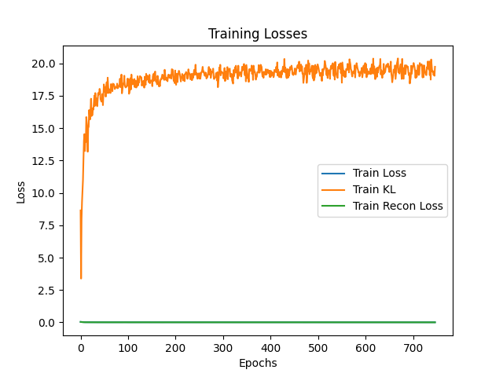
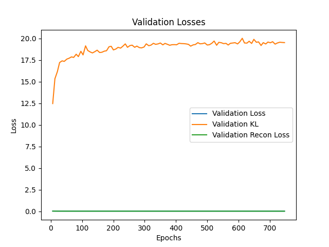
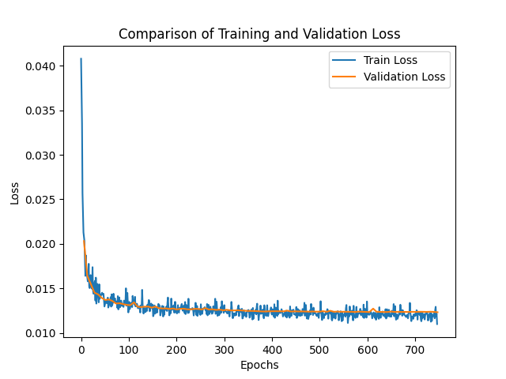

# Version 1

## Experiment Details

The experiment was conducted using the tissuemnist dataset with the following [parameters](hparams.yaml):

```yaml
batch_size: 512
checkpoint_dir: results/checkpoints/vae
config: null
dataset: tissuemnist
hidden_channels: null
input_channels: 1
kl_coeff: 0.00025
latent_dim: 128
log_dir: results/logs
lr: 0.005
max_epochs: 100
num_workers: 8
model: vae
```

## Performance Metrics

Throughout the experiment, the training and validation losses were carefully monitored. Below are the plots generated from these metrics, which can be found in the logs directory as specified in the configuration file.

### Training Loss

  
The training loss decreased steadily, indicating that the model was learning effectively over the epochs.

### Validation Loss

  
The validation loss mirrored the training loss, suggesting that the model was generalizing well to unseen data.

### KL Divergence

  
The KL divergence plot shows how the model's latent space regularization evolved during training.

### Visual Outputs

The model's ability to generate and reconstruct images was also evaluated. The visual assessment of the model's performance is demonstrated through:

Generated Images: Sample images generated by the model are displayed below.


Reconstructions: Below are comparisons between original images and their reconstructions.

